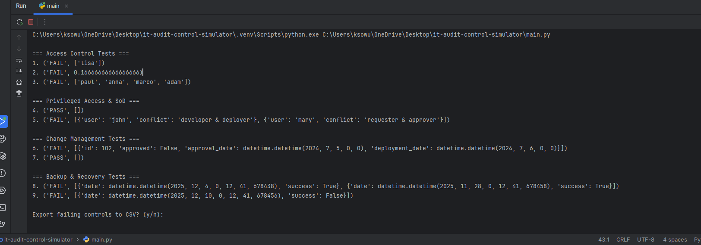

# IT Audit Control Simulator

**A Python-based IT Audit & GRC simulation platform designed to automate IT General Controls (ITGC) testing, risk assessment, and audit scenario analysis.**

This project simulates real-world audit procedures used in **Internal Audit, SOX, and Cyber Risk teams** by evaluating access controls, segregation of duties, change management, and backup & recovery controls using configurable datasets.

---

## 🎯 Who This Project Is For

- IT Audit & Internal Audit professionals  
- GRC and Cyber Risk Analysts  
- Students preparing for **CISA**, **SOC 1 / SOC 2**, or **SOX-focused roles**  
- Organizations exploring **audit automation** and continuous control monitoring  

---

## 🔍 What This Simulator Does

- Executes automated **IT General Control (ITGC)** tests
- Detects **control failures** and records detailed findings
- Simulates **audit scenarios** using configurable JSON datasets
- Supports **interactive audit scenario building**
- Generates **CSV and PDF audit reports**
- Calculates **overall risk scores and audit readiness**
- Runs via **CLI, interactive menu, or uploaded datasets**

---

## 🧠 Controls Covered

### Access Control
- Orphan accounts
- Excessive administrative privileges
- Terminated-but-active accounts

### Privileged Access & Segregation of Duties (SoD)
- Privileged role misuse
- Role conflict detection (SoD violations)

### Change Management
- Unapproved deployments
- Approval timing validation

### Backup & Recovery
- Backup recency validation
- Backup success and failure detection

---

## 📌 Why This Matters

Manual audit testing is time-consuming, inconsistent, and difficult to scale.

This simulator demonstrates how **audit procedures can be automated, standardized, and validated programmatically**, enabling:
- Reduced audit risk
- Improved consistency and repeatability
- Early detection of control failures
- Continuous monitoring concepts

The control logic aligns with:
- **SOX ITGC testing**
- **SOC 1 / SOC 2 evaluations**
- **CISA domains** (Access Control, Change Management, Operations)

---

## 📸 Sample Audit Execution

The screenshot below shows a real execution of the IT Audit Control Simulator, including automated control testing and detected failures across access control, segregation of duties, and backup controls.



---

## 🚀 Quick Start

```bash
# Run default audit scenario
python main.py

# Run interactive scenario builder
python main.py --interactive

# Launch full interactive audit menu
python main.py --menu


